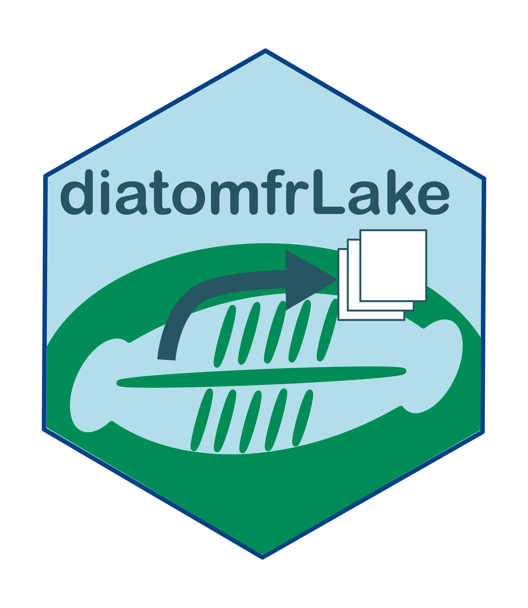

<!-- README.md is generated from README.Rmd. Please edit that file -->
<!-- badges: start -->

[](https://github.com/SebastienBoutry/diatomfrLake/actions)
<!-- badges: end -->

# `{diatomfrlake}` 

<!-- badges: start -->

[](https://www.tidyverse.org/lifecycle/#maturing)
[](commits/master)
[](https://www.gnu.org/licenses/gpl-3.0.en.html)
<!-- [](https://github.com/SebastienBoutry/IBDL/actions) -->
<!-- badges: end -->

## Installation

La version du package `{diatomfrlake}` peut se télécharger via le site
Github pour cela on aura besoin du paquet `{remotes}`:

``` r
remotes::install_github("SebastienBoutry/diatomfrlake")
library(diatomfrlake)
```

## L’objectif du paquet `{diatomfrlake}`

Le package `{diatomfrlake}` sert à importer les données issus du
protocole d’échantillonage (Morin et al. 2010) dans le logiciel R et met
en forme les données dans un format tableur. Les données doivent être au
format format soit du site Hydro-DCE ou
[OFB](https://professionnels.ofb.fr/node/398).

Afin de placer les unités d’observation potentielles, il est conseillé
d’utiliser le paquet
[`{lakemetrics}`](https://github.com/SebastienBoutry/diatomfrLake).

## Contact

<div align="center">

   :e-mail:
[Email](mailto:sebastien.boutry@inrae.fr)   \|   :speech\_balloon:
[Twitter](https://twitter.com/SebBoutry)   \|   :necktie:
[LinkedIn](https://www.linkedin.com/in/s%C3%A9bastien-boutry-4a77ba10/)

<!--
Quick Link
-->

</div>

## References:

<div id="refs" class="references csl-bib-body hanging-indent">

<div id="ref-morin:hal-02594105" class="csl-entry">

Morin, Soizic, D. Valade, Juliette Tison-Rosebery, Vincent Bertrin, M.
Cellamare, and Alain Dutartre. 2010. “<span class="nocase">Utilisation
du phytobenthos pour la bioindication en plans d’eau : Etat de l’art des
m<span class="nocase">é</span>thodes disponibles et test de m<span
class="nocase">é</span>triques sur les plans d’eau aquitains</span>.”
Research Report. Irstea. <https://hal.inrae.fr/hal-02594105>.

</div>

</div>
