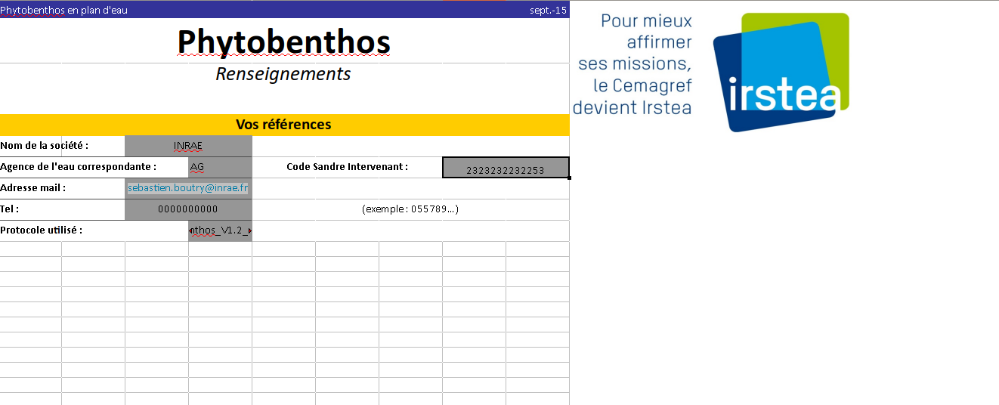
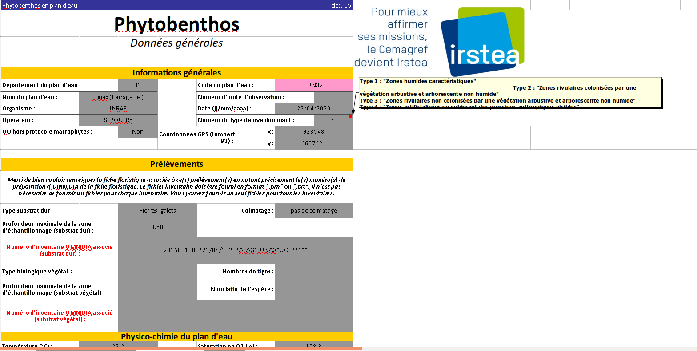

```{r setup, include = FALSE}
knitr::opts_chunk$set(
  collapse = TRUE,
  comment = "#>"
)
library(tidyr);library(dplyr);library(diatomfrlake);library(magrittr);library(kableExtra)
```

## Les données du formulaire de saisie

L'équipe ECOVEA a fourni aux agents de terrain un format standard pour l'acquisition des donées numériques. Identique aux feuilles de terrain, le formulaire de saisie facilite la retranscription des informations. 

Dans un même fichier, deux feuilles sont à remplir.

### Feuille : A renseigner

La feuille "A renseigner" recupère les coordonnées du prestataire de terrain et aussi sur la version du protocole d'échantillonnage utilisé.

{width=700px}

L'importation dans R de la feuille A renseigner se fait à l'aide de la fonction import_formulaire ou l'on présice l'argument sheet=2.

```{r import contact}
path <- system.file("", package = "diatomfrlake")
sheet_2<- import_formulaire(file="Lunax_INRAE.xls",sheet=2,repertoire = path) 
head(sheet_2)
formatting_contact(sheet_2)
```


### Feuille : Données générales

Cette feuille se sépare en plusieurs parties informations générales sur la station, sur le prélevement, la physico-chimie de l'eau et des données complémentaires sur la station.

{width=700px}

L'importation dans R de la feuille "Données générales" se fait à l'aide de la fonction import_formulaire ou l'on présice l'argument sheet=3.

```{r import data}
library(diatomfrlake)
path <- system.file("", package = "diatomfrlake")
sheet_3 <- import_formulaire(file="Lunax_INRAE.xls",sheet=3,repertoire = path) 
head(sheet_3)
sheet_3 %>% 
  formatting_data()
```

Dans la page suivante, l'utilisation des fonctions *formatting_contact()* et *formatting_data()* seront présentés pour une mise en forme de tableau

## La liste floristique fichier .prn

Le format .prn provient du logiciel Omnidia [@Lecointe1993] qui permet de mettre en forme une liste floristique diatomique. Ce logiciel intègre une base de données taxonomique des diatomées mise à jour par Michel Coste.

Le fichier .prn est constitué de trois colonnes séparés par une tabulation. La première colonne est seulement rempli pour la première ligne de la liste floristique. Elle renseigne le numéro de la lame et les informations complémentaires sur la station et l'établissement de cette liste floristique. Les informations sont séparés par des étoiles (*) et doit contenir 9 étoiles.

```{r prn}
path <- system.file("", package = "diatomfrlake")
flore <-read_prn(file ="3723.prn",repertoire=path)
head(flore)
formatting_flore(flore)
```


## Références:
